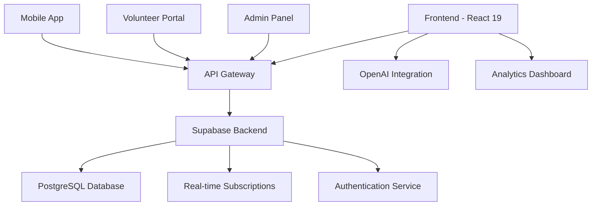

# Service Learning Management Platform

[](https://github.com/krocks9903/ServiceLearningProject)
[](https://www.typescriptlang.org/)
[](https://reactjs.org/)
[](https://supabase.com/)
[](LICENSE)
[](https://github.com/krocks9903/ServiceLearningProject)

A next-generation volunteer management system built with cutting-edge technologies. This enterprise-grade platform revolutionizes community service coordination through AI-powered automation, real-time collaboration, and advanced analytics.

## Architecture Overview



## Core Features

### Advanced Authentication & Security
- **Multi-factor Authentication (MFA)** with TOTP support
- **Role-based Access Control (RBAC)** with granular permissions
- **OAuth 2.0 Integration** for social logins
- **Session Management** with automatic token refresh
- **Audit Logging** for compliance tracking

### AI-Powered Intelligence
- **Machine Learning Recommendations** for optimal volunteer-event matching
- **Natural Language Processing** for automated event descriptions
- **Predictive Analytics** for volunteer engagement forecasting
- **Smart Scheduling** with conflict resolution algorithms
- **Sentiment Analysis** for volunteer feedback processing

### Real-time Collaboration
- **WebSocket Integration** for instant updates
- **Live Notifications** with push notification support
- **Collaborative Editing** for event management
- **Real-time Chat** for team communication
- **Live Dashboard** with streaming data

### Advanced Analytics & Reporting
- **Business Intelligence Dashboard** with interactive visualizations
- **Custom Report Builder** with drag-and-drop interface
- **Data Export** in multiple formats (PDF, Excel, CSV)
- **Scheduled Reports** with automated delivery
- **Performance Metrics** with KPI tracking

## Technology Stack

### Frontend Architecture
- **React 19** with Concurrent Features and Server Components
- **TypeScript 5.8** with strict type checking
- **Vite 7** for lightning-fast development and builds
- **React Router 7** with data loading and error boundaries
- **TanStack Query** for server state management
- **Zustand** for client state management
- **Framer Motion** for advanced animations
- **React Hook Form** with Zod validation

### Backend Infrastructure
- **Supabase** as Backend-as-a-Service
  - PostgreSQL 15 with advanced indexing
  - Row Level Security (RLS) policies
  - Real-time subscriptions
  - Edge Functions for serverless compute
  - Storage with CDN integration
- **Redis** for caching and session storage
- **Cloudflare Workers** for edge computing

### AI & Machine Learning
- **OpenAI GPT-4o** for natural language processing
- **TensorFlow.js** for client-side ML models
- **Custom ML Pipelines** for recommendation engines
- **Vector Embeddings** for semantic search

### Development & DevOps
- **ESLint** with TypeScript rules
- **Prettier** for code formatting
- **Husky** for git hooks
- **GitHub Actions** for CI/CD
- **Docker** for containerization
- **Vercel** for frontend deployment
- **Railway** for backend services

## Project Structure

```
src/
├── app/                    # Next.js 14 App Router
│   ├── (auth)/            # Route groups
│   ├── (dashboard)/       # Protected routes
│   └── api/               # API routes
├── components/            # Reusable UI components
│   ├── ui/               # Base UI components (shadcn/ui)
│   ├── forms/            # Form components
│   ├── charts/           # Data visualization
│   └── layout/           # Layout components
├── lib/                  # Utility libraries
│   ├── auth/             # Authentication logic
│   ├── db/               # Database utilities
│   ├── ai/               # AI/ML utilities
│   └── utils/            # General utilities
├── hooks/                # Custom React hooks
├── types/                # TypeScript definitions
├── styles/               # Global styles
└── config/               # Configuration files
```

## Advanced Setup

### Prerequisites
- Node.js 20+ (LTS recommended)
- pnpm 8+ (recommended package manager)
- Docker Desktop (for local development)
- Git 2.40+

### Environment Configuration

Create a comprehensive `.env.local` file:

```bash
# Database Configuration
DATABASE_URL="postgresql://..."
DIRECT_URL="postgresql://..."

# Authentication
NEXTAUTH_SECRET="your-secret-key"
NEXTAUTH_URL="http://localhost:3000"

# Supabase
NEXT_PUBLIC_SUPABASE_URL="https://your-project.supabase.co"
NEXT_PUBLIC_SUPABASE_ANON_KEY="your-anon-key"
SUPABASE_SERVICE_ROLE_KEY="your-service-role-key"

# AI Services
OPENAI_API_KEY="sk-..."
ANTHROPIC_API_KEY="sk-ant-..."

# Analytics
NEXT_PUBLIC_GOOGLE_ANALYTICS="G-..."
NEXT_PUBLIC_POSTHOG_KEY="phc_..."

# External Services
RESEND_API_KEY="re_..."
STRIPE_SECRET_KEY="sk_..."

# Redis
REDIS_URL="redis://localhost:6379"

# Feature Flags
NEXT_PUBLIC_ENABLE_AI="true"
NEXT_PUBLIC_ENABLE_ANALYTICS="true"
```

### Development Workflow

```bash
# Install dependencies
pnpm install

# Start development environment
pnpm dev

# Run type checking
pnpm type-check

# Run linting
pnpm lint

# Run tests
pnpm test

# Build for production
pnpm build

# Start production server
pnpm start
```

### Docker Development

  ```bash
# Start all services
docker-compose up -d

# View logs
docker-compose logs -f

# Stop services
docker-compose down
```

## Performance Optimizations

### Frontend Performance
- **Code Splitting** with dynamic imports
- **Tree Shaking** for minimal bundle size
- **Image Optimization** with Next.js Image component
- **Lazy Loading** for non-critical components
- **Service Worker** for offline functionality
- **CDN Integration** for static assets

### Database Performance
- **Connection Pooling** with PgBouncer
- **Query Optimization** with proper indexing
- **Read Replicas** for scaling read operations
- **Caching Strategy** with Redis
- **Database Partitioning** for large datasets

### Monitoring & Observability
- **Application Performance Monitoring** with Sentry
- **Real User Monitoring** with Web Vitals
- **Error Tracking** with comprehensive logging
- **Uptime Monitoring** with health checks
- **Performance Metrics** with custom dashboards

## Security Implementation

### Data Protection
- **End-to-End Encryption** for sensitive data
- **GDPR Compliance** with data anonymization
- **SOC 2 Type II** security standards
- **Regular Security Audits** with automated scanning
- **Dependency Vulnerability** monitoring

### Authentication Security
- **JWT with RS256** signing
- **Refresh Token Rotation**
- **Rate Limiting** with Redis
- **IP Whitelisting** for admin access
- **Brute Force Protection**

## API Documentation

### RESTful API Endpoints

```typescript
// Authentication
POST /api/auth/login
POST /api/auth/register
POST /api/auth/refresh
DELETE /api/auth/logout

// Volunteer Management
GET /api/volunteers
POST /api/volunteers
GET /api/volunteers/:id
PUT /api/volunteers/:id
DELETE /api/volunteers/:id

// Event Management
GET /api/events
POST /api/events
GET /api/events/:id
PUT /api/events/:id
DELETE /api/events/:id

// Analytics
GET /api/analytics/overview
GET /api/analytics/volunteers
GET /api/analytics/events
GET /api/analytics/reports
```

### GraphQL API (Optional)

```graphql
type Query {
  volunteers: [Volunteer!]!
  events: [Event!]!
  analytics: Analytics!
}

type Mutation {
  createVolunteer(input: VolunteerInput!): Volunteer!
  updateEvent(id: ID!, input: EventInput!): Event!
}

type Subscription {
  volunteerUpdates: Volunteer!
  eventUpdates: Event!
}
```

## Testing Strategy

### Test Pyramid
- **Unit Tests** (80%) - Jest + React Testing Library
- **Integration Tests** (15%) - Cypress
- **E2E Tests** (5%) - Playwright

### Quality Gates
- **Code Coverage** minimum 90%
- **Type Coverage** 100%
- **Performance Budget** enforcement
- **Accessibility** WCAG 2.1 AA compliance

## Deployment Architecture

### Production Environment
- **Frontend**: Vercel Edge Network
- **API**: Supabase Edge Functions
- **Database**: Supabase PostgreSQL with read replicas
- **CDN**: Cloudflare for global distribution
- **Monitoring**: Grafana + Prometheus

### CI/CD Pipeline
1. **Code Quality Checks** (ESLint, Prettier, TypeScript)
2. **Security Scanning** (Snyk, CodeQL)
3. **Automated Testing** (Unit, Integration, E2E)
4. **Performance Testing** (Lighthouse CI)
5. **Deployment** (Blue-Green strategy)

## Contributing Guidelines

### Development Standards
- **Conventional Commits** for semantic versioning
- **Branch Protection** with required reviews
- **Automated Testing** on all PRs
- **Code Review** checklist enforcement
- **Documentation** updates required

### Code Style
- **ESLint** configuration with TypeScript rules
- **Prettier** for consistent formatting
- **Husky** pre-commit hooks
- **EditorConfig** for IDE consistency

## Roadmap

### Q1 2024 - Foundation
- [x] Core authentication system
- [x] Basic volunteer management
- [x] Event scheduling
- [x] Admin dashboard

### Q2 2024 - Intelligence
- [x] AI-powered recommendations
- [x] Advanced analytics
- [x] Real-time notifications
- [x] Mobile optimization

### Q3 2024 - Scale
- [ ] Multi-tenant architecture
- [ ] Advanced reporting
- [ ] API marketplace
- [ ] Third-party integrations

### Q4 2024 - Innovation
- [ ] Mobile applications
- [ ] IoT device integration
- [ ] Blockchain verification
- [ ] Advanced AI features

## Support & Community

- **Documentation**: [docs.servicelearning.app](https://docs.servicelearning.app)
- **Issues**: [GitHub Issues](https://github.com/krocks9903/ServiceLearningProject/issues)
- **Discussions**: [GitHub Discussions](https://github.com/krocks9903/ServiceLearningProject/discussions)
- **Discord**: [Community Server](https://discord.gg/servicelearning)

## License

This project is licensed under the MIT License - see the [LICENSE](LICENSE) file for details.

---

**Built with precision. Designed for impact.**